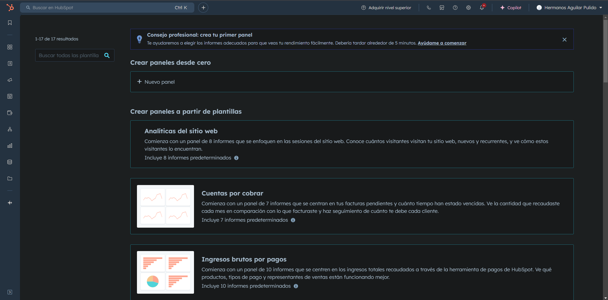
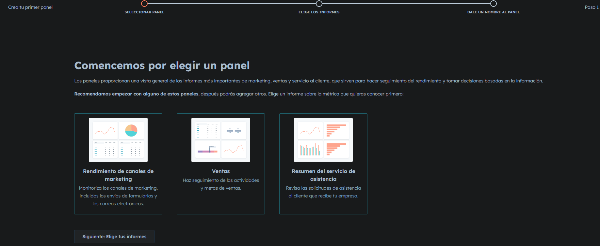
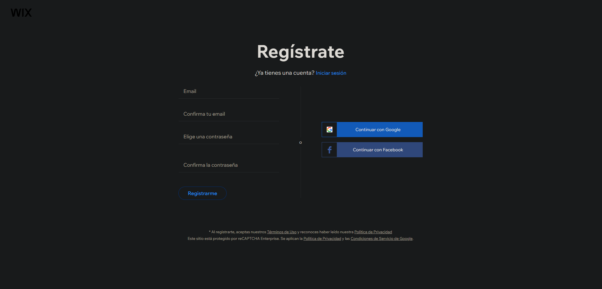
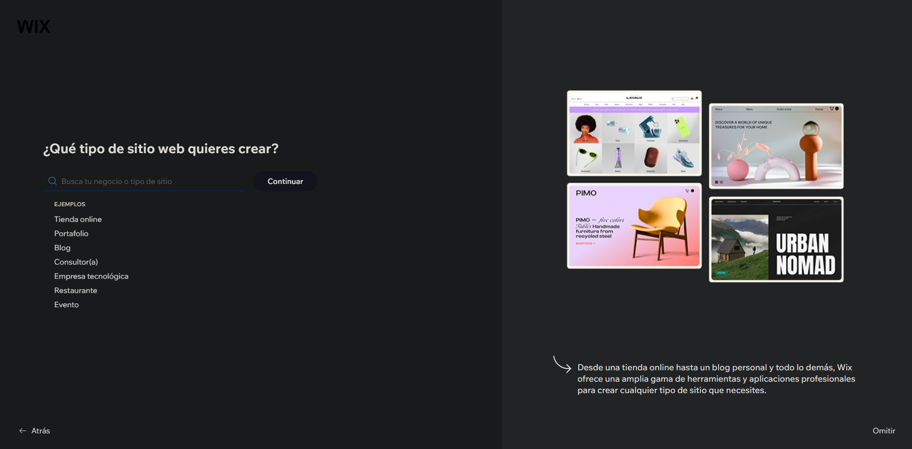
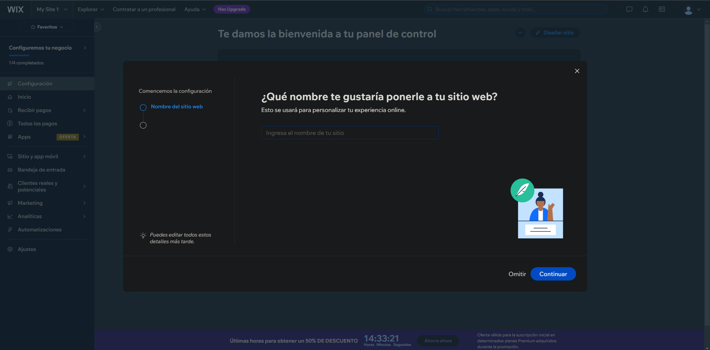
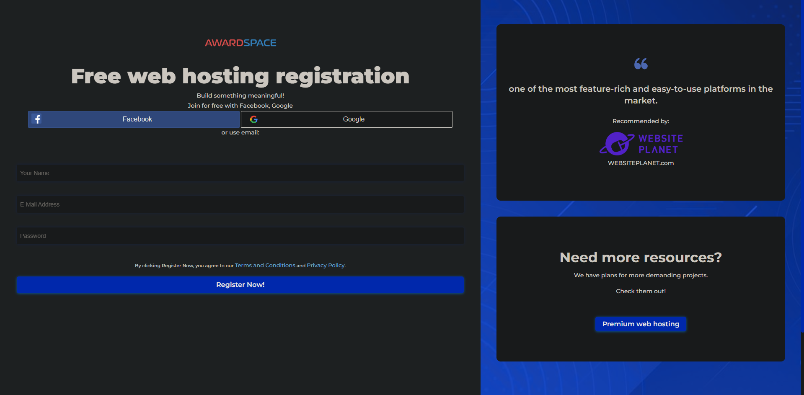
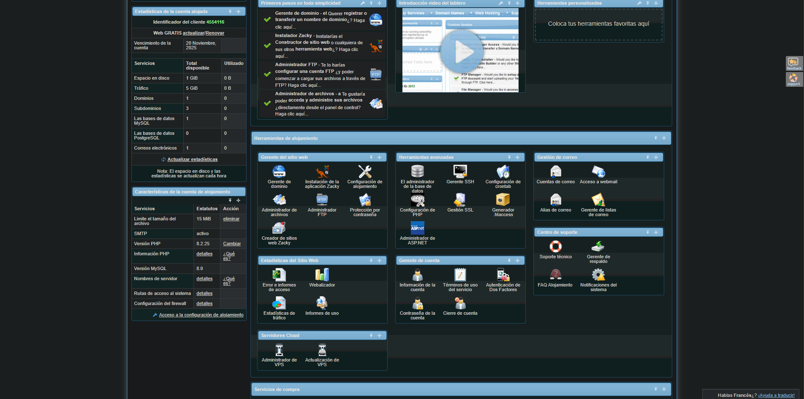

# 5 Free-Hosting-Servers

| Proveïdor              | Espai d'emmagatzematge | Ample de banda       | Dominis i Subdominis   | Certificat SSL | Publicitat | Altres Característiques         |
|------------------------|------------------------|----------------------|------------------------|----------------|------------|----------------------------------|
| [*Hubspot*](https://www.hubspot.es/)          | 250 MB per arxiu      | Il·limitat           | Domini                | Sí             | Sí         | Integració CRM, analítica integrada          |
| [*Infomaniak*](https://www.infomaniak.com/es)            | 10 GB                  | 10 GB               | Domini personalitzat  | No             | No         | Eina de correu professional          |
| [*Wix*](https://es.wix.com/)             | 50 GB                 | 100 GB              | Domini i subdominis    | Sí             | No         | Plantilles web, suport 24/7      |
| [*Awardspace*](https://www.awardspace.com/)          | 2 GB                  | 5 GB                | Subdominis inclosos    | Sí             | No         | Constructor web, suport bàsic    |
| [*Byet Internet Services*](https://byet.host/)| 5 GB                  | Il·limitat          | Subdominis inclosos                    | Opcional       | Sí         | Hosting gratuït amb restriccions |

###### En el servicio de Infomaniak debemos de pagar 5€ euros mensuales para poder tener el dominio .es o .com, todo esto depende del pais en el cual se haga el registro 
## Hubspot
Es una pagina web que nos permite de una forma sencilla y rapida gracias a sus cientos de plantilas a poder crear nuestra web para poder atraer a los clientes a nuestro servicio

Podemos crear paneles gracias a su servicio de estadisticas para poder gestionar la empresa con las herramientas que tienen implementadas en la web
 
## Wix
En este servicio podemos crear de manera sencilla usando Inteligencia artificial nuestra propia pagina web, la cual posteriormente podemos modificar, iniciamos la creación de la cuenta con google

Despues nos preguntara de que ira nuestra empresa, y tambien nos pedira el nombre

Elegimos la opción con inteligencia artificial y gracias a los datros que le hemos dado nos creara una pagina web automaticamente
.png)

## Award Space
Con este servicio podemos almacenar datos pequeños de forma gratuita o de pago, en este caso el servicio gratis en el que cada archivo tiene un maximo de tamaño de 15 MiB y de 1Gb de almacenamiento.

Primero nos pide iniciar sesion o registrar

Despues de esto simplemente podemos almacenar los archivos de manera sencilla y rapida

